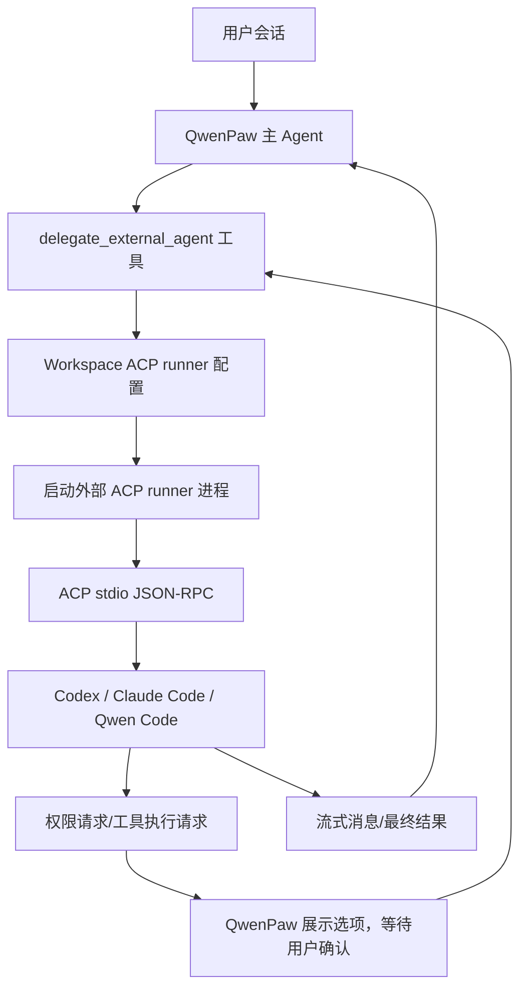
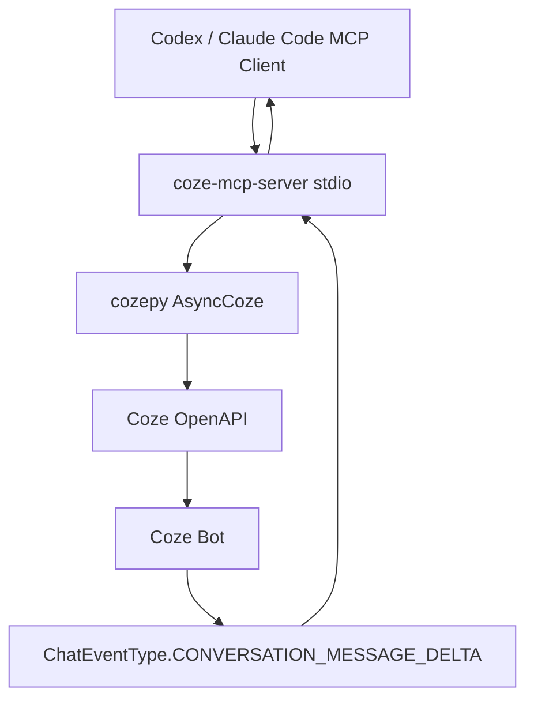
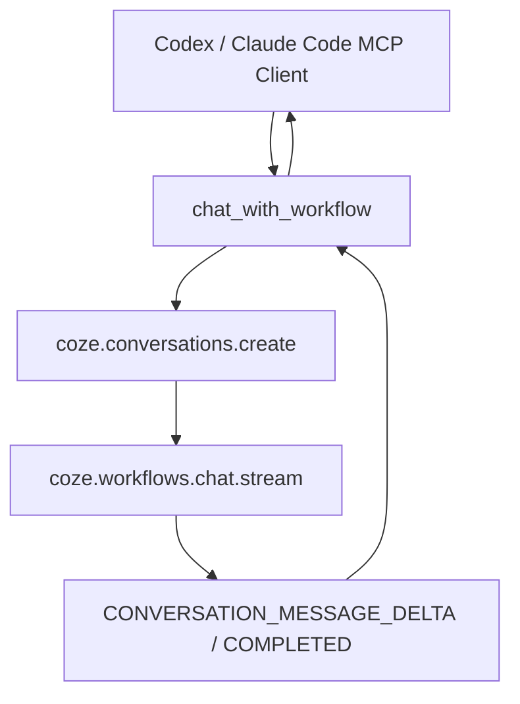
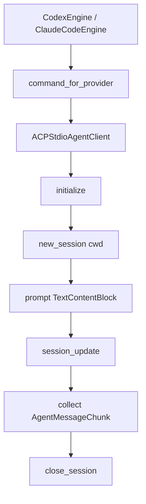

# QwenPaw 与新版 Coze 接入 Codex / Claude Code 技术调研

> 调研日期：2026-06-02  
> 目标：梳理 QwenPaw 工具与新版 Coze 平台的技术实现细节，重点覆盖二者接入 Codex 与 Claude Code 的流程、协议、鉴权、调用链路、难点与解决方案，并评估 AgentHub 当前接入实现是否合理。

## 1. 调研结论摘要

### 1.1 总体判断

- **QwenPaw 已明确支持 ACP 方向集成**：截至公开文档与 README 显示的最新版本 **v1.1.10（2026-06-01）**，QwenPaw 支持两种 ACP 模式：
  1. 将外部 ACP runner（如 `opencode`、`qwen_code`、`claude_code`、`codex`）作为 `delegate_external_agent` 工具委托调用；
  2. 通过 `qwenpaw acp` 将 QwenPaw 自身暴露为 ACP Server，供外部客户端连接。
- **QwenPaw 对 MCP 的定位与 ACP 明确区分**：MCP 用于连接外部服务/工具服务器；ACP 用于连接外部 agent runtime。这个边界非常关键。
- **新版 Coze / 扣子当前更适合通过 MCP 或 OpenAPI 接入 Codex / Claude Code**：Coze 官方生态已有 `coze-mcp-server`，基于 `FastMCP + cozepy`，面向 Claude.app、Zed 等 MCP 客户端。Codex / Claude Code 如果作为 MCP 客户端使用，可通过配置该 MCP Server 调用 Coze 的 Bot、Workflow、Workspace 等能力。
- **AgentHub 当前接入 Codex / Claude Code 的方向有参考价值，但实现尚不正确/不稳健**：项目文档称“ACP 对接 Codex / Claude Code”，但当前实际引擎使用的是自定义 `initialize` / `execute` JSON-RPC 行协议，不符合 QwenPaw 文档披露的 ACP 方法链，也没有使用项目中已存在的 `acp` Python SDK 客户端。默认命令也依赖第三方或未核实包名，存在协议不匹配风险。

### 1.2 推荐路线

- 如果 AgentHub 想像 QwenPaw 一样“委托外部编码 Agent 执行任务”，应走 **ACP runner 模式**，并统一使用 `acp.client.connection.ClientSideConnection` 所在实现链路。
- 如果 AgentHub 想把 Coze 能力提供给 Codex / Claude Code，应走 **MCP Server 模式**，把 Coze Bot/Workflow 封装成工具，不应伪装成 ACP runner。
- 如果 AgentHub 想让 Codex / Claude Code 调用 AgentHub 自身，则应实现 **AgentHub MCP Server** 或 **AgentHub ACP Server**，二选一取决于目标是“工具能力”还是“完整 agent runtime”。

## 2. QwenPaw 最新能力与实现细节

### 2.1 当前版本与核心特性

根据 QwenPaw README 与发布说明，最新公开版本为 **v1.1.10（2026-06-01）**，重点功能包括：

- `spawn_subagent`：在工作区内派生临时子 Agent。
- Coding 模式新增“打开目录”：可直接引用本地项目，不必复制到工作区。
- 飞书 Thread Reply、腾讯元宝渠道、动态上传限制。
- v1.1.9 已引入 Coding 模式（三面板 Web IDE）、Tauri 桌面应用、统一访问控制。
- v1.1.7 已引入 OAuth 2.1 MCP。

QwenPaw 本身定位为个人 AI Agent Workstation，提供：

- 本地 / 云端部署；
- 多渠道接入；
- Skills 扩展；
- MCP 工具扩展；
- 多 Agent 协作；
- 记忆与主动任务；
- 多层安全机制。

### 2.2 QwenPaw 接入 Codex / Claude Code 的方式

QwenPaw 文档将 Codex / Claude Code 归入 **外部 ACP runner** 示例，接入方式不是 MCP，而是 **ACP as Tool**。

#### 2.2.1 配置流程

1. 安装外部支持 ACP 的 agent runtime，例如 Codex、Claude Code、OpenCode、Qwen Code，或相应 ACP 插件。
2. 在命令行侧完成登录/API Key 配置，确保该 runner 可独立启动。
3. 在 QwenPaw 控制台进入 **Workspace → ACP**。
4. 配置并启用 runner，字段包括：
   - `enabled`
   - `command`
   - `args`
   - `env`
   - `trusted`
   - `tool_parse_mode`
   - `stdio_buffer_limit_bytes`
5. 启用内置工具 `delegate_external_agent`。
6. 在对话中指定 runner，由 QwenPaw 发起委托。

macOS / Linux 通常直接配置外部 agent 的 ACP 启动命令，例如 `opencode`、`qwen` 或 `npx` + ACP 插件参数。Windows 则通过 `cmd /c ...` 包装，且每个参数需单独配置。

#### 2.2.2 功能调用链路

QwenPaw 的 ACP as Tool 调用链路可抽象为：



`delegate_external_agent` 支持的动作：

| 动作 | 含义 |
|---|---|
| `start` | 启动新的委托 ACP 会话 |
| `message` | 向已有委托会话发送后续消息 |
| `respond` | 使用权限请求中的精确 option id 响应 runner |
| `close` | 关闭委托 ACP 会话 |

#### 2.2.3 采用的集成协议

- **协议名称**：ACP（Agent Client Protocol）。
- **传输方式**：stdio JSON-RPC。
- **核心对象**：外部 agent runtime，而不是普通工具服务器。
- **权限处理**：当外部 runner 请求权限，QwenPaw 暂停委托流程，将权限详情与选项展示给用户，由用户选择后再继续。

QwenPaw 同时支持 **QwenPaw as ACP Server**：

- 命令：`qwenpaw acp`
- 传输：stdin/stdout JSON-RPC
- 支持方法：`initialize`、`new_session`、`load_session`、`resume_session`、`list_sessions`、`close_session`、`prompt`、`set_session_model`、`set_config_option`、`cancel`
- 流式通知：`session_update`
- 更新类型：`agent_message_chunk`、`agent_thought_chunk`、`tool_call`、`tool_call_update`

这与“ACP as Tool”方向相反：

| 维度 | QwenPaw as ACP Server | QwenPaw using ACP as Tool |
|---|---|---|
| QwenPaw 角色 | 被外部客户端连接的 Server | 主控编排者 / Client |
| 连接方向 | 外部客户端 → QwenPaw | QwenPaw → 外部 runner |
| 目标 | 编辑器集成、程序化控制 QwenPaw | 委托外部 agent runtime 协作 |
| 入口 | `qwenpaw acp` | `delegate_external_agent` + runner 配置 |

### 2.3 QwenPaw 的 MCP 实现细节

QwenPaw 明确将 MCP 用于外部服务/工具接入。支持配置格式：

1. 标准 `mcpServers` 格式；
2. 直接键值对格式；
3. 单客户端格式。

支持传输：

| 传输 | 用途 | 必填字段 |
|---|---|---|
| `stdio` | 本地命令行 MCP Server | `command` |
| `streamable_http` | 远程 HTTP MCP Server | `url` |
| `sse` | SSE MCP Server | `url` + `transport: "sse"` |

MCP 配置字段包括 `name`、`description`、`enabled`、`transport`、`url`、`headers`、`command`、`args`、`env`、`cwd`。远程服务鉴权通常通过 `headers.Authorization`，本地服务密钥通过 `env` 传入。

### 2.4 QwenPaw 身份鉴权机制

#### 2.4.1 模型/API Key 鉴权

- 云端模型需要在控制台 Settings → Models 配置 API Key，或通过 `qwenpaw init` / 环境变量配置。
- DashScope 可使用 `DASHSCOPE_API_KEY`。
- 本地模型（Ollama、LM Studio、llama.cpp）不需要 API Key。

#### 2.4.2 MCP 鉴权

- 本地 stdio MCP：通过 `env` 注入密钥，例如 `TAVILY_API_KEY`。
- 远程 MCP：通过 `headers` 注入认证头，例如 `Authorization: Bearer ...`。
- v1.1.7 已出现 OAuth 2.1 MCP 支持。

#### 2.4.3 Web 控制台认证

QwenPaw Web 登录认证默认关闭，可通过 `QWENPAW_AUTH_ENABLED=true` 启用：

- 首次访问注册唯一管理员账户；
- 支持 `QWENPAW_AUTH_USERNAME` / `QWENPAW_AUTH_PASSWORD` 自动注册；
- 密码加盐 SHA-256 哈希；
- HMAC-SHA256 签名令牌，7 天有效；
- 令牌存储在浏览器 localStorage；
- `auth.json` 使用 `0o600` 权限；
- 本地 `127.0.0.1` / `::1` 默认免认证；
- 仅 `/api/*` 路由受保护，静态资源与认证相关 API 公开。

### 2.5 QwenPaw 核心技术难点与解决方案

| 难点 | 解决方案 |
|---|---|
| MCP 与 ACP 容易混淆 | 文档明确：MCP 接服务/工具，ACP 接 agent runtime |
| 外部 runner 权限不可代用户决定 | 权限请求暂停，展示选项，用户选择 option id 后继续 |
| Agent 误操作本地文件/命令 | Tool Guard、File Guard、Skill Scanner 三层安全 |
| 编码任务上下文不足 | Coding 模式注入项目目录、cwd、引用格式、TODO 约束，并注册 `lsp` / `ast_search` |
| 直接操作现有项目有风险 | 支持“打开目录”和“导入副本”两种模式，副本模式隔离原工作树 |
| 多平台命令启动差异 | Linux/macOS 直接命令，Windows 使用 `cmd /c` 包装 |
| Web 控制台外暴露风险 | 可选 Web 登录认证 + 本地免认证白名单 |

## 3. 新版 Coze 平台技术实现与接入方式

### 3.1 新版 Coze 平台形态

截至 2026-06-02，从 Coze 页面公开元信息与 OpenAPI/SDK 生态看，新版 Coze / 扣子主要是 **AI Agent 智能办公平台**，覆盖：

- Bot / Agent 创建与发布；
- Workflow 编排与运行；
- 插件、知识库、模型管理；
- OpenAPI、OAuth、Personal Access Token；
- Web SDK、Response API、Workflow as Agent、多模态/音频实时能力等功能开关。

注意：Coze 平台本体并不是 Codex / Claude Code 的 ACP runner；它更像一个 **Agent/Workflow SaaS 平台**。因此接入 Codex / Claude Code 时，合理方式通常是把 Coze 暴露成 **MCP 工具服务** 或通过 OpenAPI 直接调用。

### 3.2 Coze MCP Server 实现细节

Coze 官方/生态仓库 `coze-mcp-server` 当前 PyPI 版本为 **0.0.4**，描述为 “MCP Server for Coze(coze.com/coze.cn)”。其核心依赖：

- `cozepy>=0.13.0`，当前 PyPI 最新 `cozepy` 为 **0.20.0**；
- `mcp[cli]>=1.5.0`；
- `pydantic>=2.0.0`。

实现核心：

```python
from mcp.server import FastMCP
from cozepy import AsyncCoze, AsyncTokenAuth, COZE_CN_BASE_URL

mcp = FastMCP("coze-mcp")
server = CozeServer(api_base, api_token)
```

配置来源：

- 环境变量：`COZE_API_TOKEN`、`COZE_API_BASE`
- CLI 参数：`--coze-api-token`、`--coze-api-base`
- 默认 `api_base`：`COZE_CN_BASE_URL`

### 3.3 Coze MCP 暴露工具

`coze-mcp-server` 暴露的 MCP 工具包括：

| 工具 | 功能 |
|---|---|
| `get_me` | 获取当前用户信息 |
| `list_workspaces` | 列出工作空间 |
| `list_bots` | 列出空间内 Bot |
| `retrieve_bot` | 获取 Bot 详情 |
| `create_bot` | 创建 Bot |
| `update_bot` | 更新 Bot |
| `publish_bot` | 发布 Bot 到 API channel |
| `chat_with_bot` | 与 Bot 对话 |
| `chat_with_workflow` | 与 Workflow 对话 |
| `list_voices` | 列出音色 |

Bot 对话调用链：



Workflow 对话调用链：



### 3.4 Coze 接入 Claude Code 的流程

Claude Code 官方支持 MCP Server 配置，MCP 配置位置包括：

- 用户范围：`~/.claude.json`
- 项目范围：`.mcp.json`
- 本地项目范围：`~/.claude.json` 中的 per-project 状态
- 企业托管：`managed-mcp.json`

使用 `coze-mcp-server` 的 Claude 配置示例：

```json
{
  "mcpServers": {
    "coze-mcp-server": {
      "command": "uvx",
      "args": ["coze-mcp-server"],
      "env": {
        "COZE_API_TOKEN": "your-token",
        "COZE_API_BASE": "https://api.coze.cn"
      }
    }
  }
}
```

也可使用：

```json
{
  "mcpServers": {
    "coze-mcp-server": {
      "command": "python",
      "args": ["-m", "coze_mcp_server"],
      "env": {
        "COZE_API_TOKEN": "your-token"
      }
    }
  }
}
```

或 Docker：

```json
{
  "mcpServers": {
    "coze-mcp-server": {
      "command": "docker",
      "args": ["run", "-i", "--rm", "ghcr.io/coze-dev/coze-mcp-server"],
      "env": {
        "COZE_API_TOKEN": "your-token"
      }
    }
  }
}
```

### 3.5 Coze 接入 Codex 的流程

Codex CLI 的主流扩展方式同样是配置 MCP Server。接入 Coze 时建议使用 stdio MCP：

```toml
[mcp_servers.coze]
command = "uvx"
args = ["coze-mcp-server"]

[mcp_servers.coze.env]
COZE_API_TOKEN = "your-token"
COZE_API_BASE = "https://api.coze.cn"
```

如果使用全局/项目配置，应根据 Codex 当前版本文档放置到对应 `config.toml`。关键原则是：

- Codex 是 MCP Client；
- `coze-mcp-server` 是 MCP Server；
- Coze API Token 不进入 prompt，而是通过 MCP server 的环境变量或安全配置注入。

### 3.6 Coze 身份鉴权机制

Coze Python SDK README 明确支持：

- Personal Access Token；
- JWT OAuth；
- Web OAuth；
- PKCE OAuth；
- Device OAuth。

PAT 获取入口：

- 中国区：`https://www.coze.cn/open/oauth/pats`
- 国际区：`https://www.coze.com/open/oauth/pats`

SDK 初始化方式：

```python
from cozepy import Coze, TokenAuth, COZE_CN_BASE_URL

coze = Coze(
    auth=TokenAuth(coze_api_token),
    base_url=coze_api_base or COZE_CN_BASE_URL,
)
```

MCP Server 使用 `AsyncTokenAuth(token=api_token)`，本质是 bearer token 风格 API 鉴权。

### 3.7 Coze 核心技术难点与解决方案

| 难点 | 解决方案 |
|---|---|
| coze.cn / coze.com API 域名不同 | 通过 `COZE_API_BASE` 显式配置，默认走 `COZE_CN_BASE_URL` |
| MCP 客户端无法直接保存平台 OAuth 流程状态 | 简化为 PAT / 环境变量注入，复杂场景使用 OAuth App 生成 access token |
| Bot/Workflow 返回流式事件而 MCP 工具常需要文本结果 | MCP Server 聚合 `CONVERSATION_MESSAGE_DELTA` 为字符串返回 |
| Bot/Workflow ID 容易被模型误处理 | MCP Server 对 ID 做 `id:` 包装与 `unwrap_id` 处理 |
| 发布/更新 Bot 涉及权限 | Coze token 需要具备相应 workspace/bot 权限，MCP Server 本身不绕过平台权限 |
| 不同客户端配置格式不同 | 提供 Claude.app、Zed、pip、uvx、Docker 多种配置样例 |

## 4. Codex 与 Claude Code 的协议、鉴权、接入边界

### 4.1 MCP 与 ACP 的边界

| 协议 | 连接对象 | 典型场景 | 对 Codex / Claude Code 的意义 |
|---|---|---|---|
| MCP | 工具/服务/资源服务器 | 数据库、API、文件系统、Coze Bot/Workflow | Codex / Claude Code 作为 MCP Client 调用外部工具 |
| ACP | Agent runtime | 编码 Agent、外部自动化 Agent、多 Agent 委托 | QwenPaw / AgentHub 作为 client 编排外部 agent，或自身作为 ACP server 被编辑器驱动 |

判断准则：

- “我想给 Codex/Claude Code 增加一个可调用工具” → MCP。
- “我想把 Codex/Claude Code 当成另一个 Agent 委托任务” → ACP。
- “我想让外部编辑器驱动我的 AgentHub” → ACP Server。

### 4.2 Claude Code 鉴权与配置

公开文档显示：

- Claude Code 的 OAuth session、用户/本地 MCP 配置、per-project 状态等存储在 `~/.claude.json`。
- 项目范围 MCP 服务器配置存储在 `.mcp.json`。
- 企业托管 MCP 可使用 `managed-mcp.json`。
- 设置文件包括 `~/.claude/settings.json`、`.claude/settings.json`、`.claude/settings.local.json`。
- Claude Code 支持 `apiKeyHelper`：自定义脚本生成 auth value，并以 `X-Api-Key` 与 `Authorization: Bearer` 发送给模型请求。

因此，第三方平台接入 Claude Code 不应直接读取或伪造 Claude 的 OAuth session，而应通过官方 CLI/MCP/ACP 入口启动。

### 4.3 Codex 鉴权与配置

Codex CLI 的典型鉴权由 Codex CLI 自身处理，外部系统如果通过 Codex ACP runner 或 MCP 客户端配置接入，应遵循：

- 不在 AgentHub 数据库中保存 Codex 账号 OAuth session；
- 不把 Codex 登录凭据写入 prompt；
- 通过 Codex CLI 已登录态或环境变量/API key 完成模型侧认证；
- 外部工具鉴权通过 MCP server 的 `env` / headers 注入。

## 5. AgentHub 当前接入实现评估

### 5.1 当前项目接入现状

相关文件：

- `agenthub-backend/app/agent_runtime/engine/impl_codex.py`
- `agenthub-backend/app/agent_runtime/engine/impl_claude_code.py`
- `agenthub-backend/app/agent_runtime/mcp/_transport.py`
- `agenthub-backend/app/agent_runtime/acp/acp_stdio.py`
- `agenthub-backend/app/agent_runtime/acp/external_runner.py`
- `agenthub-backend/app/agent_runtime/acp/provider_commands.py`
- `agenthub-backend/docs/architecture.md`

当前文档声明：

- `engine_type = acp:codex` 使用 Codex ACP 引擎；
- `engine_type = acp:claude_code` 使用 Claude Code ACP 引擎；
- 默认命令：
  - `AGENTHUB_ACP_CODEX_COMMAND = npx -y @zed-industries/codex-acp`
  - `AGENTHUB_ACP_CLAUDE_COMMAND = python -m claude_code_acp`

### 5.2 主要问题

#### 问题 1：当前引擎使用了非标准/未核实的 ACP 方法链

`impl_codex.py` 与 `impl_claude_code.py` 当前调用：

```python
await transport.send_request({"method": "initialize", ...})
await transport.send_request({"method": "execute", ...})
```

但 QwenPaw ACP Server 文档披露的方法是：

- `initialize`
- `new_session`
- `prompt`
- `close_session`
- 等

项目中 `acp/acp_stdio.py` 也已经使用了 `acp.client.connection.ClientSideConnection`，并调用：

- `initialize(protocol_version=acp.PROTOCOL_VERSION)`
- `new_session(cwd=...)`
- `prompt([...], session_id=...)`
- `close_session(...)`

这说明当前引擎没有使用更接近标准 ACP 的实现，而是使用了 `mcp/_transport.py` 里自造的 JSON-RPC 行协议，协议不匹配风险很高。

#### 问题 2：命令类型不一致

`mcp/_transport.py` 的 `ACPRunnerConfig.command` 是 `str`，并传给：

```python
subprocess.Popen(self._config.command, ...)
```

未设置 `shell=True`。当 command 是默认字符串 `"npx -y @zed-industries/codex-acp"` 时，`Popen` 会尝试寻找完整文件名，通常无法正确启动。

而 `provider_commands.py` 返回的是 `list[str]`，更适合 `create_subprocess_exec(*command)`。项目内两套实现类型不一致。

#### 问题 3：ACP 与 MCP 命名混淆

`agent_runtime/mcp/_transport.py` 实际写的是 `ACPRunnerConfig` / `ACPTransport`，但放在 `mcp` 目录下。这会造成协议边界混乱。

建议：

- `mcp/` 只处理 MCP client/server；
- `acp/` 只处理 ACP runner/client/server；
- 不要把 ACP transport 放在 MCP 包下。

#### 问题 4：工具调用链路没有接入标准 ACP 权限模型

当前 `mcp/_transport.py` 只发送请求并读一行 stdout，没有处理：

- `session_update` 流式通知；
- `request_permission`；
- 文件读写 callback；
- terminal callback；
- session 生命周期。

`acp/acp_stdio.py` 虽然拒绝了文件/终端能力，但至少有权限回调、session update、session 生命周期。这更接近可控安全模型。

#### 问题 5：工具执行器参数未真正用于当前 Codex/Claude 引擎

`impl_codex.py` / `impl_claude_code.py` 要求 `tool_executor` 非空，但实际没有把 AgentHub 内置工具暴露给外部 runner，只是向 runner 发送 prompt。这与 QwenPaw 的 `delegate_external_agent` 模式不同。

`external_runner.py` 有一个“让模型输出 JSON tool_calls，然后 AgentHub 执行工具”的提示词方案，但它不是 ACP 标准工具协议，更像 prompt-level tool shim，可靠性较低。

#### 问题 6：默认 runner 包名/可用性未固化验证

- `@zed-industries/codex-acp` 与 `python -m claude_code_acp` 是否仍是当前可用 runner，需要在安装/启动时验证。
- 如果 runner 不存在或协议变更，当前代码没有 health check / capability discovery。

#### 问题 7：配置模型中 provider active 未参与引擎选择

`acp_providers` 表可以启用/禁用 provider，但 `create_engine` 只根据 `engine_type` 创建引擎，未检查 provider 是否 active，也未读取 provider 的 command/env/auth_config。

### 5.3 当前实现是否合理正确

结论：**方向部分合理，实现目前不算正确，不能视为生产可用接入。**

| 维度 | 评价 | 说明 |
|---|---|---|
| 选择 ACP 接 Codex / Claude Code | 基本合理 | 如果目标是委托外部 coding agent，ACP 是合理方向 |
| 用 MCP 接 Coze | 合理 | Coze 是服务/平台能力，应通过 MCP/OpenAPI 暴露工具 |
| 当前 Codex/Claude 引擎协议 | 不正确/高风险 | 使用自定义 `execute` 方法，不符合已知 ACP session/prompt 模型 |
| 当前进程启动 | 有 bug 风险 | 字符串命令直接传 `Popen`，未拆分参数 |
| 当前权限处理 | 不充分 | 没有处理 ACP permission request；只在另一套 SDK 客户端中有拒绝逻辑 |
| 当前工具链路 | 不完整 | `tool_executor` 未真正纳入标准外部 runner 工具能力 |
| 当前配置治理 | 不完整 | provider 表与实际启动命令/active 状态脱节 |
| 安全性 | 偏保守但功能弱 | 文件/终端禁用是安全的，但也使 coding runner 无法真正执行代码任务 |

## 6. AgentHub 推荐改造方案

### 6.1 短期修正：统一使用 ACP SDK 客户端

将 `impl_codex.py` / `impl_claude_code.py` 改为使用：

- `app.agent_runtime.acp.provider_commands.command_for_provider`
- `app.agent_runtime.acp.acp_stdio.ACPStdioAgentClient`
- 或 `app.agent_runtime.acp.external_runner.run_acp_tool_loop`（但建议减少 prompt-level JSON tool shim）

标准链路：



### 6.2 中期增强：接入 provider 配置与健康检查

建议增加：

- provider command/args/env 从 `acp_providers.auth_config_json` 或专门字段读取；
- 启动前 health check：命令存在、版本、是否支持 ACP、`initialize` 是否成功；
- active provider 校验；
- stderr 日志采集；
- 超时和 cancellation。

### 6.3 权限与工具策略

有两种可选策略：

#### 策略 A：外部 runner 自带工具，AgentHub 只做权限网关

- 外部 Codex/Claude Code 自己读写文件/跑命令；
- AgentHub 通过 ACP permission callback 决策；
- 适合 coding agent 真正修改项目；
- 风险：需要实现细粒度审批、路径沙箱、cwd 限制。

#### 策略 B：外部 runner 不直接操作系统，只向 AgentHub 请求工具

- 外部 runner 的文件/终端 callback 由 AgentHub 实现；
- 所有文件/命令经过 AgentHub 工具权限系统；
- 适合企业内控；
- 难点：必须按 ACP callback 协议实现 `read_text_file`、`write_text_file`、`create_terminal`、`terminal_output` 等，而不是 prompt 里要求输出 JSON。

当前项目更接近策略 B，但实现还停留在 prompt shim，应升级为真实 ACP callback。

### 6.4 Coze 接入建议

如果要让 AgentHub / Codex / Claude Code 使用 Coze：

1. 不要把 Coze 当 ACP runner。
2. 通过 `coze-mcp-server` 接入：
   - stdio MCP；
   - `COZE_API_TOKEN` 注入；
   - `COZE_API_BASE` 区分 coze.cn / coze.com。
3. 如果 AgentHub 需要统一治理，可内置一个 Coze MCP 配置模板，并在 AgentHub UI 中管理 token。
4. 对于企业场景，优先 OAuth App / 短期 token，不建议长期 PAT 明文存库。

### 6.5 安全建议

- 移除 `app/core/config.py` 中硬编码 `openai_api_key`，改为环境变量必填或空默认。
- ACP/MCP 密钥统一加密存储，不进入 prompt、日志和前端明文。
- 对外部 runner 的 `cwd` 限制在项目工作区内。
- 文件写入与命令执行使用审批策略，至少区分：只读、写文件、执行命令、联网、删除/覆盖。
- 记录 runner 会话审计日志：命令、cwd、权限请求、用户批准、文件/终端操作。

## 7. 推荐实施优先级

| 优先级 | 事项 | 价值 |
|---|---|---|
| P0 | 修复 `Popen(str command)` 与协议链路，统一 ACP SDK | 避免根本无法启动/协议不通 |
| P0 | 删除/迁移硬编码 API Key | 安全底线 |
| P1 | provider active/config/env 真正参与 runner 启动 | 让控制台配置有效 |
| P1 | 实现 ACP permission request UI/后端状态机 | 接近 QwenPaw 安全模型 |
| P1 | 明确 MCP/ACP 包目录与文档边界 | 降低后续维护成本 |
| P2 | 增加 Coze MCP 模板 | 快速支持 Coze Bot/Workflow 工具化 |
| P2 | 外部 runner health check/capability discovery | 提升可运维性 |
| P3 | 实现 AgentHub as ACP Server | 让外部编辑器/runner 连接 AgentHub |

## 8. 参考来源

- QwenPaw GitHub README：`https://github.com/agentscope-ai/QwenPaw`
- QwenPaw MCP 文档：`https://qwenpaw.agentscope.io/docs/mcp.zh.md`
- QwenPaw Coding 模式文档：`https://qwenpaw.agentscope.io/docs/coding-mode.zh.md`
- QwenPaw ACP 集成文档：`https://qwenpaw.agentscope.io/docs/acp-integration.zh.md`
- QwenPaw 安全文档：`https://qwenpaw.agentscope.io/docs/security.zh.md`
- Coze MCP Server：`https://github.com/coze-dev/coze-mcp-server`
- Coze MCP Server PyPI：`https://pypi.org/project/coze-mcp-server/`
- Coze Python SDK：`https://github.com/coze-dev/coze-py`
- Coze Python SDK PyPI：`https://pypi.org/project/cozepy/`
- Claude Code MCP 文档：`https://code.claude.com/docs/en/mcp`
- Claude Code Settings 文档：`https://code.claude.com/docs/en/settings`
- Agent Client Protocol：`https://agentclientprotocol.com/`
