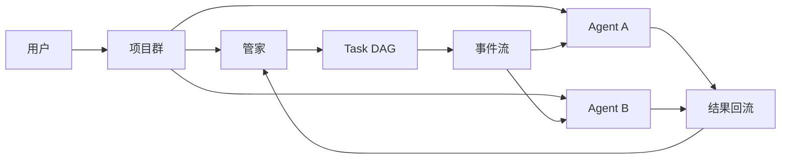

# AgentHub 多智能体协作设计

## 1. 协作定义

AgentHub 的多智能体协作采用中心调度模式。用户在项目群中提出目标，管家负责规划和调度，执行型 agent 负责具体节点执行，结果再回到管家复核。

它不是自由对话式的 agent 网络，而是一个带项目经理角色的协作系统。

## 2. 协作容器

多智能体协作的核心容器是 `project` 群组。

群组中统一存在三类成员：

1. 用户成员
2. 执行型 agent 成员
3. 管家型 system 成员

其中：

- 用户负责提出目标和确认结果
- 执行 agent 负责完成任务节点
- 管家负责组织整体流程

## 3. 协作结构

## 4. 协作入口

协作入口是消息，而不是任务 API。

项目群收到用户消息后：

1. 系统解析 mentions
2. 如果提及管家，则进入 manager runtime
3. 如果提及普通 agent，则进入 agent runtime

这说明当前协作是显式触发式，而不是自治轮询式。

## 5. 事件驱动机制

你的双智能体协作不是直接函数互调，而是明显的事件驱动形式。

核心特点是：

1. 消息先落库，再生成事件
2. 事件由 dispatcher 分发到对应 handler
3. handler 再决定是进入管家、普通 agent，还是任务执行链路
4. 执行结果不会直接结束，而是再次写回事件流
5. 管家基于回流事件继续复核、重试或推进下一步

也就是说，系统真正的协作总线不是对话文本本身，而是 `MessageEvent`。

一次典型链路如下：

1. 用户在项目群发消息
2. 系统创建 `message.created` 类事件
3. dispatcher 根据事件类型调用对应 handler
4. 管家生成任务或触发节点执行
5. `node_execute` 写入 `NODE_EXEC_STARTED`
6. task handler 拉起执行型 agent
7. agent 完成后写入 `TASK_COMPLETED` 或 `TASK_FAILED`
8. 管家再次接管，做复核、返工或继续调度

这套设计的价值在于：

1. 解耦
   管家、执行 agent、任务系统不用直接强绑定调用。
2. 可追踪
   每一步都有事件记录，方便回放和排错。
3. 易扩展
   后续增加新的协作角色或新的处理链路时，可以继续挂到事件分发体系里。
4. 更适合双智能体协作
   一个负责编排，一个负责执行，中间通过事件交接，职责边界清晰。

## 6. 管家的职责

管家是当前协作模型的中心节点，负责：

1. 理解目标
2. 读取项目记忆、说明和短期上下文
3. 生成或修改任务 DAG
4. 分配执行节点
5. 触发节点执行
6. 复核执行结果

当前系统里的高阶协作几乎都经过管家。

## 7. DAG 的作用

多智能体协作不是靠自由讨论完成，而是靠 `Task Run + Task Node` 驱动。

节点包含的关键要素有：

- `node_key`
- `title`
- `detail`
- `role_required`
- `deps`
- `assignee_member_id`
- `status`
- `manager_review_status`

这让协作具备：

1. 依赖关系
2. 分工关系
3. 状态推进
4. 复核回路

## 8. 协作执行链路

一次典型的多智能体协作链路如下：

1. 用户在项目群中提出任务
2. 管家生成或修改任务图
3. 管家调用 `node_execute`
4. 系统写入节点执行事件
5. task handler 拉起对应 agent 执行
6. agent 返回结果
7. 系统写入完成或失败事件
8. 管家再次接管并复核结果

这是一个“管家下发 -> agent 执行 -> 管家复核”的闭环。

## 9. 当前协作模式的特点

### 优点

1. 可控
   有统一编排中心，不容易失控。
2. 可追踪
   消息、事件、任务节点和 trace 都可查看。
3. 适合工程任务
   很适合软件项目中的拆解、执行、复核和返工。

### 限制

1. 中心化较强
   管家容易成为瓶颈。
2. agent 间缺少直接协作
   子 agent 主要通过管家间接协作。
3. 角色路由仍偏轻
   `role_required` 还是较弱的字符串约束。

## 10. 当前协作类型

系统里实际存在三种协作方式：

1. 人 -> 单 agent
2. 人 -> 管家 -> 单 agent
3. 人 -> 管家 -> 多节点 -> 多 agent

第三种才是完整的多智能体协作模式。

## 11. 建议方向

1. 保留总管家，同时增加二级角色管家
2. 允许 agent 间受控协作
3. 强化角色与能力路由
4. 增加 run 级和 node 级协作记忆

## 12. 总结

AgentHub 当前的多智能体协作，本质上是“项目群驱动、管家中心调度、事件流转、任务图组织”的协作系统。它的重点不在 agent 数量，而在于把多个 agent 真正组织进一套可执行、可复核的流程里。
